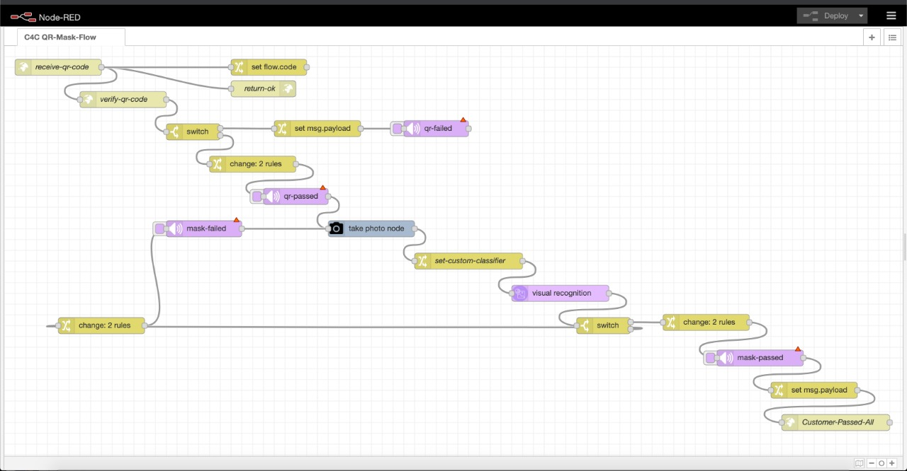

# Safe For Business
As the world embarks on opening up again after the lockdown. Businesses have been reluctant to do so. Mainly because of three things:
Health and safety of staff and customers.
Demand is not high anymore.
Customers are not comfortable.

Especially the businesses in the entertainment industry.

That is why we created a product that promises the ultimate business experience with the customers’ and the business owners mind at ease.

Whether its a supermarket, mall or business office, you need not worry about safety guidelines and the effects of cover, let IBM and Watson do that while you do what you always do best and focus on your business.

The product assures customers and business owners that the premises is safe before they lay eyes on it.
[Project website](https://safeforbusiness.eu-gb.cf.appdomain.cloud/#/home)

## Section 1. Pipeline

The product is split into three main functions:
1. First is the mobile app. That relays important metrics of safety to the user. Other than news and alerts about regulations from the business, Metrics are shown. like how many people are inside the premise at the moment. Will it busy in the next hour, 3hours or emptier, The schedule for the whole week with capacity of people inside in times slots.
The user can then use the chatbot to make an appointment to visit the premise in a very simple manner.
2. The second function is the IOT device on the door. By simply scanning your appointment QR code. The user was told he should be wearing a mask and the camera on the door vastly and swiftly detects that so that he can be allowed entry.
3. The third component are the in-house cameras that are analyzing social distancing measures being kept between people. 

## Section 2. Node-RED Flow
For the Node-RED flow, it is as described in step 2 in Section 1. 

### Results
All of these components are outputting metrics of safety to the customer and owner to the mobile app to give them the total comfort of going back to shops and businesses like before.

## Acknowledgments

* We would like to thank user basileroth75 for the social-distancing algorithm. Refer to the [README](README.md) for their repo.