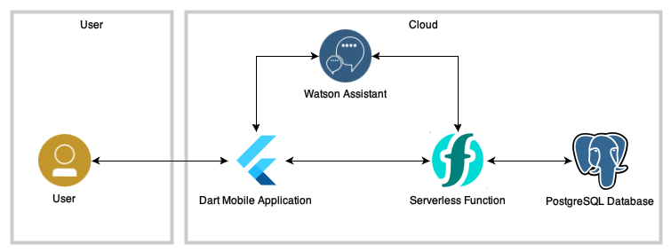
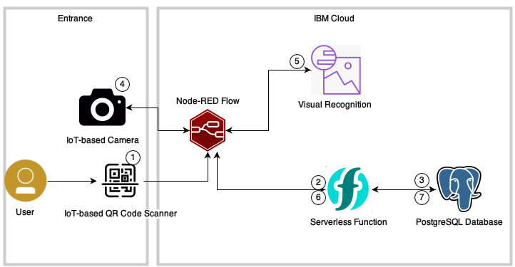
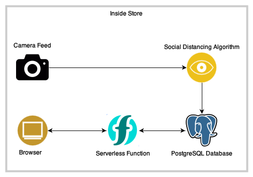
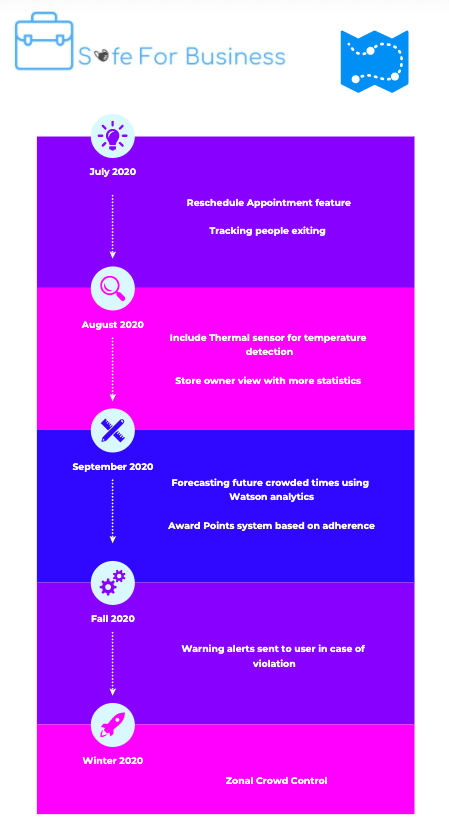

## Contents

1. [Short description](#short-description)
1. [Demo video](#demo-video)
1. [The architecture](#the-architecture)
1. [Long description](#long-description)
1. [Project roadmap](#project-roadmap)
1. [Getting started](#getting-started)
1. [Live demo](#live-demo)
1. [Built with](#built-with)
1. [Authors](#authors)
1. [License](#license)
1. [Acknowledgments](#acknowledgments)

## Short description

### What's the problem?

As the world embarks on opening up again after the lockdown, businesses have been reluctant to do so, due to factors such as health and safety of staff and customers. Similarly, demand is not high anymore, and customers are not comfortable.

### How can technology help?

Businesses can continue to maintain their shops by ensuring that individuals are social-distancing. This can be done by having people book appointments to their stores and adhere to wearing masks. 
### The idea

It is important that businesses are able to continue operating in times of crises, such as the COVID-19 pandemic. Using a set of open source tools, along with IBM Cloud and Watson services, will help businesses operate easily and make their customers more comfortable and safe from the virus.

## Demo video

## The architecture

Our application is split into 3 different aspects. Each one has a different architecture.
### Step 1

1. The site displays to the user the available slots with its crowdedness.
2. The user can request to book a timeslot by writing their request to Watson Assistant intgrated into an app.
3. Watson Assistant queries the PostgreSQL database through Cloud Functions to check if the slot is valid.
4. If the slot is valid, it is saved in the database and a QR Code generated from Cloud Functions is sent back to the user.

### Step 2

1. In front of the store, the user will scan his/her QR Code from Step 1, where it is processed by a Node-RED Flow.
2. A Cloud Function triggered from the Node-RED Flow will query the DB to see it the QR Code exists.
3. If the QR Code exists, the Node-RED will trigger the IoT-based Camera to capture an image.
4. The IoT-based Camera will send the image to the Node-RED Flow, where it will be processed by Watson Visual Recognition.
5. Watson Visual Recognition will do mask detection on the image.
6. If a mask is detected, the Node-RED Flow will trigger a Cloud Function to remove the QR Code from the DB.

### Step 3

1. The camera feed is sent to the Social Distancing algorithm.
2. The Social Distancing algorithm processes the camera feed and returns the number of violations.
3. The number of violations is saved in a local PostgreSQL Database. 
4. The number of violations is displayed to the business in their application.

## Long description

[More detail is available here](Description.md)

## Project roadmap

## Getting started

These instructions will get you a copy of the project up and running on your IBM Cloud for testing purposes.

### Prerequisites

1. A QR Code gun/phyical scanner
2. Flutter Command Line
3. IBM Cloud Account
4. Instal this repo on your local machine

### Installing
NOTE: Replace ALL of the credentials found in this application/services with your OWN credentials accordingly.

1. Create a PostgreSQL Database, and record the DB's credentials. Run this [query](DB/query.sql) to build the tables.
2. For the Python functions, put each function in a different Action on IBM Cloud Functions, and record the API for each function. 
3. In the Queue-Functions folder, import the skill to a Watson Assistant. Replace the API in the Webhook with the API of book_query function.
4. Train a Watson Visual Recognition to detect face masks.
5. Create a Node-RED app on IBM Cloud and import the flow found [here](iot/flows/qr-mask.flow). Replace the credentials found in the flow for each respective service.
6. For the social-distancing algorithm, refer to this [repo](https://github.com/basileroth75/covid-social-distancing-detection). However, parts of the code have been modified, so refer to this [code](Social%20Distancing/social_distanciation_video_detection.py) instead of the original one.
7. Build the application using Flutter CMD. Refer to this [link](https://flutter.dev/docs/get-started/web). Substitute 'myapp' with 'covidapp'.
8. Deploy the built application on Cloud Foundry.

## Live demo

You can find a running system to test at [safeforbusiness.eu-gb.cf.appdomain.cloud](https://safeforbusiness.eu-gb.cf.appdomain.cloud/#/home)

## Built with

* [PostgreSQL Database](https://cloud.ibm.com/catalog?search=postgres#search_results) - The SQL database used
* [IBM Cloud Functions](https://cloud.ibm.com/catalog?search=cloud%20functions#search_results) - The compute platform for handling logic
* [Flutter](https://flutter.dev/) - The web framework used
* [IBM Node-RED App](https://cloud.ibm.com/catalog?search=node-red#search_results) - The programming tool used for the IoT flow
* [IBM Cloud Foundry](https://cloud.ibm.com/catalog?search=foundry#search_results) - The platform used for deployment.

## Authors
* Karim Deif
* Mohammed Badreldin
* Mostafa Abdelaleem
* Youssef Alnemr

See also the list of [contributors](https://github.ibm.com/developer-advocacy-egy/c4c-covidapp/graphs/contributors) who participated in this project.

## License

This project is licensed under the MIT License - see the [LICENSE](LICENSE) file for details

## Acknowledgments

Refer to [this](Description.md).